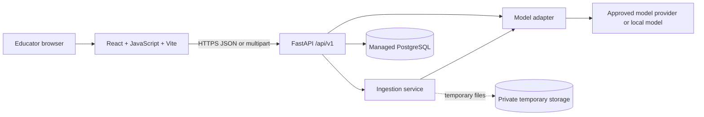
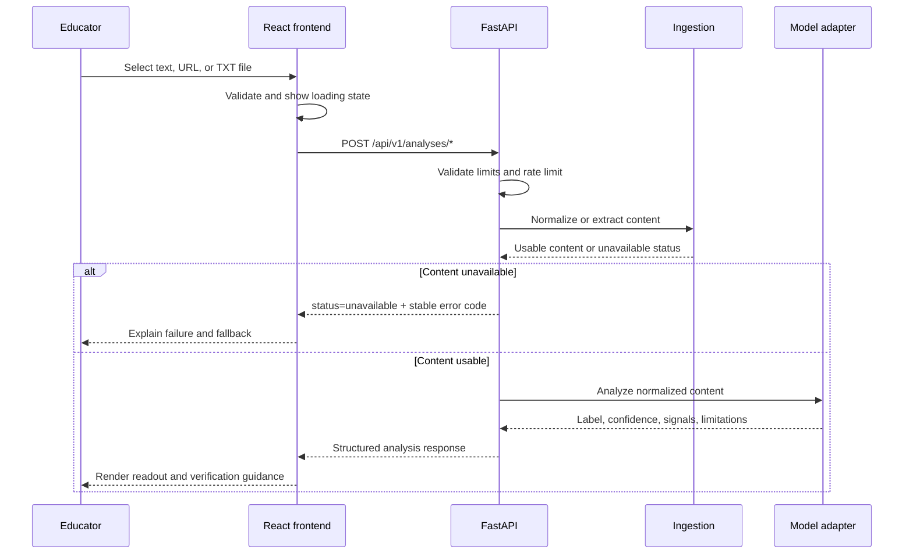

# Signal Desk — Fake News Detection

Signal Desk is an educational fake-news detection prototype for educators and classroom discussions. It accepts pasted article text, public article URLs, and plain-text documents, then presents a model prediction, confidence score, model-derived signals, and limitations. The product is deliberately framed as a **prediction aid, not an independent fact-checker**.

> A model label is the beginning of the conversation—not proof that a claim is true or false.

## Project status

The repository currently contains a polished React frontend and a JavaScript API client for the planned FastAPI analysis service. The FastAPI service, PostgreSQL persistence, object storage, authentication, and model runtime are not included in this repository yet. The frontend therefore supports the complete request lifecycle and contract-shaped responses, but a live analysis result requires a configured FastAPI API.

| Capability | Current status |
|---|---|
| Signal Desk responsive frontend | Implemented |
| Text, URL, and plain-TXT submission UI | Implemented |
| Client validation, request timeout, retry, and error states | Implemented |
| Staged loading animation | Implemented |
| FastAPI REST client | Implemented against the documented contract |
| Real model inference | Requires FastAPI implementation/configuration |
| PostgreSQL persistence | Designed, not provisioned in this frontend repository |
| Authentication | Deferred; MVP analysis is anonymous |
| PDF/DOCX parsing | Intentionally disabled in the current frontend MVP |

## Architecture

The intended production architecture is a modular monolith with independently deployable frontend and backend services. The browser owns interaction and presentation. FastAPI owns validation, URL fetching, document parsing, model orchestration, rate limiting, and response shaping. Database and object-storage access must remain server-side.



### Runtime flow

For text input, the frontend validates the minimum and maximum length, then sends JSON to `POST /api/v1/analyses/text`. For URL input, the frontend validates the URL shape, while FastAPI must perform all SSRF-sensitive fetching and extraction. For a plain-text upload, the frontend performs early MIME, extension, and size feedback, while FastAPI must independently validate bytes, content signature, size, parsing, and storage lifecycle.

The frontend waits for a structured response. A successful response renders the prediction, confidence, model signals, modalities, model metadata, and limitations. An `unavailable` response or transport failure renders an actionable error state. The retry button repeats the request using the current input and returns to the loading state.



## Repository structure

The active Manus web project uses `client/` for the static frontend. The architecture documents under `docs/` describe the intended full-stack expansion.

```text
fake-news-detection/
├── README.md
├── package.json
├── pnpm-lock.yaml
├── vite.config.js
├── client/
│   ├── index.html
│   └── src/
│       ├── App.jsx
│       ├── main.jsx
│       ├── index.css
│       ├── components/
│       │   ├── ui/              # Scaffolded Radix/shadcn primitives
│       │   └── ErrorBoundary.jsx
│       ├── contexts/
│       ├── hooks/
│       ├── lib/
│       │   ├── analysisApi.js   # FastAPI transport and response envelope handling
│       │   ├── inputValidation.js
│       │   └── utils.js
│       ├── pages/
│       │   ├── Home.jsx
│       │   └── NotFound.jsx
│       └── lib/*.test.js        # Vitest unit tests
├── docs/
│   └── backend-security-handoff.md
├── server/
│   └── index.ts                 # Scaffold compatibility server, not the FastAPI API
├── shared/
├── ideas.md                     # Signal Desk design system and review decisions
└── todo.md
```

## Prerequisites

Install Node.js 20 or newer and pnpm. The project was developed with Node.js 22 and pnpm 10. The frontend does not require a database, model credential, or authentication provider to start locally, but analysis requests require a reachable FastAPI service.

## Local setup

Clone the repository and install dependencies:

```bash
git clone https://github.com/Mammu-Ali/fake-news-detection.git
cd fake-news-detection
pnpm install
```

Configure the FastAPI base URL through a Vite client environment variable. This value is public frontend routing configuration; it must never contain an API key or other secret.

```bash
# .env.local
VITE_ANALYSIS_API_URL=http://localhost:8000/api/v1
```

If the frontend and API share an origin through a reverse proxy, use the default or set:

```bash
VITE_ANALYSIS_API_URL=/api/v1
```

Start the development server:

```bash
pnpm dev
```

The Vite development server prints the local preview URL. Restart the development server after changing environment variables because Vite injects client environment variables at build time.[1]

## Available commands

| Command | Purpose |
|---|---|
| `pnpm dev` | Start the Vite development server |
| `pnpm test` | Run the Vitest unit suite once |
| `pnpm run check` | Run the current build-based project check |
| `pnpm run build` | Build the frontend and scaffold compatibility server |
| `pnpm run preview` | Preview the Vite production build |
| `pnpm run format` | Format repository files with Prettier |

The current `check` script runs `vite build`; it is not a substitute for type checking, linting, integration tests, or end-to-end tests. The project is JavaScript-based, so runtime validation and automated tests are the primary correctness controls.

## FastAPI API usage

The frontend expects a versioned REST API under `/api/v1`. The client uses JSON for text and URL requests and multipart form data for plain-text documents. Requests are sent without authentication because the approved MVP is anonymous-first.

### Text analysis

```http
POST /api/v1/analyses/text
Content-Type: application/json
Accept: application/json

{
  "text": "Article text supplied by the educator",
  "language": "en"
}
```

### URL analysis

```http
POST /api/v1/analyses/url
Content-Type: application/json
Accept: application/json

{
  "url": "https://example.com/article",
  "language": "en"
}
```

The frontend only checks URL syntax and scheme. FastAPI must perform safe fetching, including SSRF protection, private-network blocking, redirect limits, response-size limits, content-type restrictions, DNS/IP checks, and timeouts.

### Document analysis

The current frontend intentionally sends only plain TXT files. The request uses the `file` multipart field:

```bash
curl -X POST "$VITE_ANALYSIS_API_URL/analyses/document" \
  -H 'Accept: application/json' \
  -F 'file=@article.txt;type=text/plain'
```

PDF and DOCX support should not be enabled until the backend has tested hardened parsers, content-signature validation, resource limits, malware controls where required, and temporary-file deletion.

### Successful response

```json
{
  "analysis_id": "opaque-id",
  "status": "complete",
  "prediction": {
    "label": "Fake",
    "confidence": 0.78
  },
  "explanation": {
    "type": "model_signals",
    "signals": [
      {
        "kind": "salient_text",
        "text": "highlighted phrase",
        "description": "Text span associated with the model prediction"
      }
    ],
    "external_verification_used": false
  },
  "modalities_analyzed": ["text"],
  "limitations": [
    "This is a model prediction, not proof that the claim is true or false."
  ],
  "model": {
    "name": "approved-model-name",
    "version": "approved-version",
    "threshold_defined": true,
    "confidence_calibrated": false
  }
}
```

The frontend renders `prediction.label`, `prediction.confidence`, `explanation.signals`, `limitations`, `modalities_analyzed`, and the model name/version. The backend must not claim calibrated confidence, external verification, image analysis, or factual proof unless those capabilities have been evaluated and approved.

### Unavailable response

```json
{
  "analysis_id": "opaque-id",
  "status": "unavailable",
  "error": {
    "code": "INSUFFICIENT_EXTRACTED_TEXT",
    "message": "We could not extract enough usable article text to analyse this item."
  },
  "fallback": "Paste the article text or upload a supported text document."
}
```

The client also handles HTTP failures, network failures, timeouts after 30 seconds, non-JSON responses, malformed successful responses, and caller-triggered cancellation. The user sees safe messages rather than provider stack traces.

### Health and metadata endpoints

The broader architecture reserves these public or restricted endpoints:

| Method | Path | Purpose |
|---|---|---|
| `GET` | `/api/v1/health/live` | Process liveness |
| `GET` | `/api/v1/health/ready` | Dependency readiness; sanitize or restrict output |
| `GET` | `/api/v1/model-info` | Approved model and limitation metadata |
| `GET` | `/api/v1/analyses/{analysis_id}` | Deferred until safe retrieval and persistence policies exist |

## Data and privacy model

The MVP is anonymous and does not require a login. The frontend keeps submitted content in browser memory while the request is active and displays “Nothing is saved by default.” The intended backend policy is to avoid storing raw article text, fetched HTML, and uploaded bytes unless an explicit retention policy is approved.

If persistence is enabled later, store minimal metadata such as analysis status, input type, timestamps, model version, extraction status, and confidence. Keep raw uploads in private temporary storage with expiry and deletion. Never place raw article text, uploaded document contents, prompts, or provider credentials in logs.

The planned logical database entities are `users`, `model_versions`, `analyses`, `extraction_records`, `explanations`, and `upload_objects`. Database access belongs in FastAPI repositories; the browser should not write directly to PostgreSQL.

## Authentication

Authentication is intentionally deferred for the MVP. Anonymous analysis should remain rate-limited and should not require an email address merely to demonstrate the classroom workflow.

When saved educator workspaces become a confirmed requirement, use an approved provider such as Supabase Auth with passwordless email or institutional OAuth. The frontend may receive a session, but FastAPI must validate the token server-side, map the external identity to an internal user, enforce ownership, and prevent cross-user access. Administrative model-management endpoints require separate roles and must not be exposed to ordinary educators.

## Testing

The repository includes a Vitest command and executable unit tests:

```bash
pnpm test
```

The current suite covers valid text, empty and short text, maximum text and URL boundaries, malformed URL schemes, plain-TXT upload validation, forged MIME/extension combinations, oversized documents, documented request payloads, multipart encoding, anonymous request behavior, HTTP errors, network failures, timeout mapping, and malformed responses.

The most important deferred suites are:

| Test level | Required coverage |
|---|---|
| Unit | Validation boundaries, response normalization, API error mapping, timeout and cancellation behavior |
| Integration | FastAPI contract, SSRF defenses, upload parsing, model-provider failures, rate limits, CORS, PostgreSQL transactions and outages |
| End-to-end | Browser submission, loading state, retry recovery, unavailable state, upload flow, and future authentication journey |

Run backend integration tests against a disposable database and test storage bucket. Do not use production data. The repository’s testing strategy contains the expanded coverage map.

## Security requirements

The frontend’s validation is for usability only. It is not a security boundary because callers can bypass the browser and call FastAPI directly. Before enabling public analysis, the backend must implement the controls in [`docs/backend-security-handoff.md`](docs/backend-security-handoff.md).

The highest-priority backend requirements are SSRF protection for URL fetching, streamed request and file-size limits, content-signature validation, hardened parser handling, anonymous rate limiting, concurrency and model-cost controls, strict CORS allowlists, HTTPS outside local development, sanitized structured logs, server-side credentials, and provider-response validation. These controls are consistent with common secure URL-fetching and upload guidance.[2] [3]

## Deployment

Deploy the static frontend and FastAPI service separately or behind a managed reverse proxy. A recommended topology is:

```text
Browser → CDN/static frontend → HTTPS → FastAPI container
                                           ├── managed PostgreSQL
                                           ├── private temporary storage
                                           └── approved model endpoint/runtime
```

For same-origin deployment, route `/api/v1` to FastAPI and keep the frontend’s default API base path. For separate origins, set `VITE_ANALYSIS_API_URL` during the frontend build and configure FastAPI CORS to allow only the actual frontend origins. Do not expose model-provider credentials in Vite variables or browser code.

The current Manus scaffold still contains an Express compatibility server used by the template build. It is not the analysis backend. Production deployment should make the FastAPI boundary explicit rather than relying on the scaffold server to proxy nonexistent analysis routes.

## Known limitations

Signal Desk is an educational prototype. A prediction is not a fact-check, and confidence is not automatically the probability that a claim is true. Model behavior depends on its training data, language scope, domain, calibration, and evaluation quality. The current frontend does not independently verify external evidence or analyze images. URL extraction, document parsing, persistence, authentication, and real model inference require the corresponding FastAPI implementation and security review.

## Contributing

Keep changes focused on the product requirement being implemented. Preserve the Signal Desk visual system documented in [`ideas.md`](ideas.md), avoid logging submitted content, and add tests for new validation, API, loading, error, or persistence behavior. Run `pnpm test` and `pnpm run build` before opening a pull request.

## References

[1]: https://vite.dev/guide/env-and-mode "Vite: Env Variables and Modes"
[2]: https://owasp.org/www-community/attacks/Server_Side_Request_Forgery "OWASP: Server-Side Request Forgery Prevention Guidance"
[3]: https://cheatsheetseries.owasp.org/cheatsheets/File_Upload_Cheat_Sheet.html "OWASP: File Upload Cheat Sheet"
